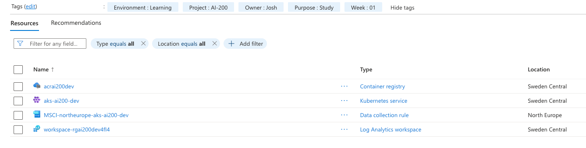

# Week 3, module 1: Deploy applications to Azure Kubernetes Service

Learning path: Deploy and monitor applications on Azure Kubernetes Service
Exam domain: Develop containerized solutions on Azure (20-25%)
Status: module 1 complete (deploy)

Kubernetes foundations plus deploying `retrieval-api` to AKS. The cluster was created
and deleted the same day. Notes below are the durable concepts only.

## The one big idea: desired state and the reconciliation loop

Kubernetes is declarative at a deeper level than "write YAML instead of commands". A
manifest describes the **desired state**. You hand it to the cluster, and a control loop
runs continuously, comparing reality against the declaration and acting to close the gap.

This is deploy-and-defend, not deploy-and-forget. Delete a pod from a Deployment of 3 and
the cluster creates a replacement to restore the count to 3. Kill a node and its pods are
rescheduled onto the survivors. You describe the destination and never the route. That is
what "self-healing" actually means, and every other object below is a variation on it.

## The core objects, bottom up

| Object | What it is | Why it exists |
| ------ | ---------- | ------------- |
| Node | A VM in the cluster | The thing that bills. A cluster has at least one. |
| Pod | The smallest unit Kubernetes runs, wrapping a container | The unit of scheduling and of failure |
| Deployment | Declares "I want N replicas" and defends that count | Turns a pod into something durable |
| Service | A stable address for a set of pods, selected by label | Absorbs pod churn |

**Pods are disposable by design.** They are created and destroyed freely and get a new IP
every time. Never get attached to a specific pod, and never treat a pod IP as an address
anything else can hold.

**Deployments create pods, you almost never do.** A Deployment creates a ReplicaSet, and
the ReplicaSet creates the pods. The pod name encodes the whole chain:
`retrieval-api-<replicaset-hash>-<pod-suffix>`, so the middle hash is the ReplicaSet and
the tail is the individual pod.

**Services make disposable pods usable.** A Service selects pods by label, not by IP. When
a pod dies and its replacement comes up with a new IP and the same label, the Service
swaps the IP in its endpoint list automatically. The front door address never changes.
Label-based selection is the mechanism that makes pod disposability survivable.

## Two tools, two control planes

This distinction is exam-relevant and worth being exact about.

| Tool | Control plane | Manages | Example |
| ---- | ------------- | ------- | ------- |
| `az` | Azure | The cluster as an Azure resource | Create or delete the cluster, add nodes, attach ACR |
| `kubectl` | Kubernetes | What runs inside the cluster | Deploy the app with `kubectl apply` |

Adding a node is `az`, because a node is a VM and VMs are Azure's concern. Deploying a
workload is `kubectl`, because pods are Kubernetes' concern.

`kubectl` is cloud-agnostic: the same binary talks to AKS, EKS, GKE, or a local cluster.
`az aks get-credentials` is the bridge between the two worlds. It writes the cluster's
connection details into `~/.kube/config` so the universal tool can reach this specific
cluster.

The same split shows in the two `get` commands. `kubectl get nodes` lists VMs
(`aks-nodepool1-...vmss...`); `kubectl get pods` lists workloads (`retrieval-api-...`).
Different object types, not two views of the same thing.

## Two brains in the control plane

- **The Deployment controller decides how many.** It defends the replica count and does
  nothing else.
- **The scheduler decides where.** For each pod it runs two phases: filter (drop nodes
  that cannot fit the pod) then score (rank the nodes that can).

The scheduler prefers to spread pods across nodes for resilience. Three replicas on two
nodes land 2/1, never 3/0, so losing a node loses at most two pods rather than all three.
Count and placement are separate decisions made by separate components, which is the same
shape as Container Apps' split between KEDA (how many) and the compute scheduler (how big).

## Pod lifecycle is the troubleshooting map

The highest-value concept in the module. The normal progression is:

`Pending` (not placed, or not pulling yet) → `ContainerCreating` (node pulling the image
and setting up) → `Running`.

Kubernetes problems present as a pod **stuck** in one of those states, and the state
names the layer that is broken:

| Stuck at | What is wrong |
| -------- | ------------- |
| `Pending` | The scheduler cannot place the pod: no room, or a constraint it cannot satisfy |
| `ContainerCreating` | The image pull is failing |
| Crash-looping after reaching `Running` | The application itself is broken |

**The diagnostic method:**

1. `kubectl get pods` shows the stuck state. That is the symptom.
2. `kubectl describe pod <name>` and read the **Events** section at the bottom. That is
   the cause.
3. Read the event text to separate causes that look identical from the outside:

| Event text | Cause | Fix |
| ---------- | ----- | --- |
| `401 unauthorized` | AcrPull not granted to the cluster identity | Authorisation problem: attach the registry |
| `404 not found` | Wrong image name or tag | Addressing problem: fix the manifest |
| `ImagePullBackOff` | Repeated pull failures, Kubernetes backing off between retries | A symptom of either of the above |

Both of the first two present as a pod stuck in `ContainerCreating`, and they have
completely different fixes. The event text is the only thing that separates them.

Learn the healthy event sequence so a broken one stands out:
`Scheduled → Pulling → Pulled → Created → Started`.

## ACR pull on AKS

Sixth time for the managed-identity pattern, and AKS bundles it into one command. The
cluster already has a managed identity (`--enable-managed-identity`), so attaching the
registry is:

```bash
az aks update --resource-group rg-ai200-dev --name aks-ai200-dev --attach-acr acrai200dev
```

Underneath it is the same who/what/where as every previous time: the cluster's kubelet
identity is the who, `AcrPull` is the what, the registry is the where. Azure just wires it
in a single call instead of three.

Note that it is an `az` command, not `kubectl`. It configures Azure resources; it deploys
nothing into Kubernetes. Skip it and pods sit in `ContainerCreating` with a
`401 unauthorized` pull event.

## Service types and the lab-smart exposure pattern

| Type | What it does | Cost |
| ---- | ------------ | ---- |
| `ClusterIP` (default) | Stable address reachable only inside the cluster | Free |
| `LoadBalancer` | Provisions a real Azure Load Balancer and a public IP | Costs money: the LB resource plus the public IP |

`ClusterIP` is the right choice for service-to-service traffic that never leaves the
cluster, for example an ingestion worker calling a vector-store pod.

The lab used `ClusterIP` and reached it from the laptop through a tunnel instead of
exposing it:

```bash
kubectl port-forward service/retrieval-api 8080:80
curl localhost:8080/health
```

No public IP, no load balancer, no cost, and nothing lingering once the tunnel closes. The
health response returned `APP_VERSION=0.5.0-aks`, the value set in the Deployment manifest,
which proves the entire chain end to end: manifest → pod → node → Service → tunnel.

## Cost is the defining fact of AKS

AKS nodes are VMs. They bill continuously, per hour, whether or not anything is deployed
on them. **There is no scale-to-zero**, unlike Container Apps in week 2, which was free
while idle. This is the one service in the roadmap that can genuinely drain the budget.

The rule: create, run the lab, **delete the cluster the same day**.

`standard_d2s_v6` × 2 is roughly $0.20/hr, so about $0.60 for a three-hour lab. The hourly
rate was never the risk. Forgetting is. The free control-plane tier (`--tier free`) means
the nodes are the entire bill.

See [`../docs/cost-matrix.md`](../docs/cost-matrix.md) for the row.

## Picking a node size took three gates

Choosing an AKS node size required clearing the AKS allow-list, the per-family vCPU quota,
and the shared regional vCPU ceiling, and it took several attempts because each error only
reveals one gate at a time. Full detail in
[`../docs/troubleshooting.md`](../docs/troubleshooting.md).

## Cluster resources



The registry, the cluster, and the Log Analytics workspace are all in Sweden Central. The
monitoring add-on's Data Collection Rule (`MSCI-northeurope-aks-ai200-dev`) is in North
Europe, because it was created without an explicit location and inherited the resource
group's region. That is the third time region inheritance has bitten; it is written up in
[`../docs/environment.md`](../docs/environment.md).

## Carried forward from week 2

- **The managed-identity pattern is now automatic.** Sixth occurrence, and AKS hides it
  behind `--attach-acr`. The principal, role, and scope underneath are unchanged.
- **Count and placement are owned by different components.** KEDA and the compute
  scheduler on Container Apps; the Deployment controller and the scheduler here.
- **Scale-to-zero needs an externally observable signal.** It also needs a platform that
  offers it. AKS does not, natively: the Horizontal Pod Autoscaler works on internal
  metrics and floors at one, and reaching zero requires installing KEDA explicitly.
