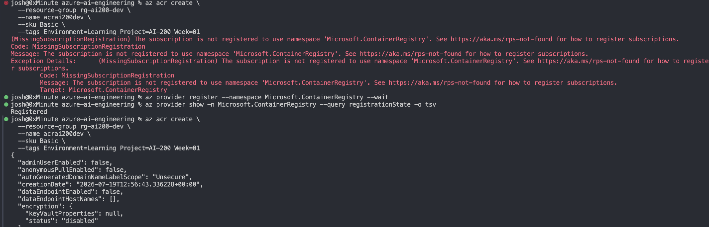

# Week 1: Implement container application hosting on Azure

Learning path: Implement container application hosting on Azure (2 hr 20 min, 2 modules)
Exam domain: Develop containerized solutions on Azure (20-25%)

## Module 1: Azure Container Registry

### Hands-On Work

1. Create azure container registry

- create rg:

```
  az group create \
   --name rg-ai200-dev \
   --location westeurope \ #changed to notheurope see #surprises below
  --tags Environment=Learning Project=AI-200 Owner=Josh Purpose=Study Week=01
```

- create acr:

```az acr create \
  --resource-group rg-ai200-dev \
  --name acrai200dev \
  --sku Basic \
  --tags Environment=Learning Project=AI-200 Week=01
```

- confirm:

```
az acr show --name acrai200dev \
 --query "{name:name, loginServer:loginServer, sku:sku.name, adminEnabled:adminUserEnabled}" \
 -o table
```

2. Write simple python app: see the projects/retrieval-api
3. Build it in the cloud
   ```
   cd projects/retrieval-api
   az acr build --registry acrai200dev --image retrieval-api:v1 .
   ```

### surprises

1.  couldn't create the acr in westeurope:
    -error:
    (RequestDisallowedByAzure) Resource 'acrai200dev' was disallowed by Azure: The selected region is currently not accepting new customers: https://aka.ms/locationineligible.
    Code: RequestDisallowedByAzure
    Message: Resource 'acrai200dev' was disallowed by Azure: The selected region is currently not accepting new customers: https://aka.ms/locationineligible.
    Target: acrai200dev
    -solution:
    recreate the rg in northeurope
2.  The subscription is not registered to use namespace 'Microsoft.ContainerRegistry'. Likely due to my brand new az subscriotion and using cli, might work without registrationfrom portal
    -error:
    MissingSubscriptionRegistration....
    -solution:
    az provider register --namespace Microsoft.ContainerRegistry --wait
    -more:
    this led me registering all resources i might need in future for this

    - run:

      ```
      for ns in Microsoft.ContainerRegistry Microsoft.App Microsoft.Web \
      Microsoft.ContainerService Microsoft.DocumentDB \
      Microsoft.DBforPostgreSQL Microsoft.Cache \
      Microsoft.ServiceBus Microsoft.EventGrid \
      Microsoft.KeyVault Microsoft.AppConfiguration \
      Microsoft.Insights Microsoft.OperationalInsights \
      Microsoft.CognitiveServices Microsoft.Storage; do
      az provider register --namespace "$ns"
      done
      ```

      

## Module 2: Deploy containers to Azure App Service

### Core concepts

- App Service plan vs web app. The plan is the compute (VM size, tier, OS) and is
  what bills. The web app runs on the plan. Multiple web apps can share one plan.
  Stopping the web app does not stop the plan billing; only deleting the plan does.
- App settings become environment variables inside the container. They are
  injected at container start; changing one restarts the app. Connection strings
  are a separate section with a type field.
- `WEBSITES_PORT`. App Service terminates TLS on 443/80 and forwards to one port
  inside the container. It must match what the app binds to (8000 for uvicorn).
- `WEBSITES_ENABLE_APP_SERVICE_STORAGE`. Mounts persistent storage at `/home`.
  Off by default; off is correct for stateless apps.
- Startup command overrides the Dockerfile `CMD` without rebuilding the image.
- Health check path. Configured on the platform, points at an app endpoint
  (`/health`). Only meaningful when scaled to more than one instance.

### Pulling from ACR with a system-assigned managed identity

This procedure repeats in weeks 3 (Container Apps) and 5 (AKS), and is the exam's
preferred answer for registry authentication.

1. Assign a system-assigned managed identity to the web app. This creates a
   service principal in Entra ID whose lifecycle is tied to the web app. No
   password, no client secret: Azure issues and rotates credentials internally.
2. Capture the identity's `principalId` and the ACR's full resource ID.
3. Create a role assignment: who = the principal, what = `AcrPull`, where =
   scoped to the ACR resource ID specifically (not the resource group, not the
   subscription).
4. Set `acrUseManagedIdentityCreds = true` on the web app. Steps 1-3 are not
   sufficient without this flag; the pull still fails.

Portal navigation notes worth recording:

- Identity is assigned at: web app > Settings > Identity > System assigned.
- The role assignment is made on the ACR, under Access control (IAM) > Add role
  assignment > AcrPull > Managed identity > App Service. Doing this from the web
  app's IAM blade instead grants permission over the wrong resource, a plausible
  exam distractor.
- `acrUseManagedIdentityCreds` is not on the Configuration blade. It is only
  exposed in Deployment Center > Settings > Authentication > Managed Identity.

Alternative auth methods, in the order the exam prefers them: managed identity,
service principal, repository-scoped token, admin account (disabled by default,
single shared credential, effectively never the right answer).

### Diagnostics

- `az webapp log config --docker-container-logging filesystem` then
  `az webapp log tail`: shows the container pull and startup sequence.
- `az webapp ssh`: shell inside the running container. Requires Basic tier or
  higher; unavailable on F1 (the portal greys out the SSH setting).
- Health check path configuration.

### Tier limitations that forced the B1 upgrade

F1 (Free) is not a smaller B1. Its limits are hard cutoffs, not throttles.
Approximately 60 CPU-minutes and ~165 MB outbound data per day. When a limit is
hit, App Service sets the app state to `QuotaExceeded` and returns HTTP 403 until
the counter resets at UTC midnight. The app is not crashed and the logs look
healthy.

Why this bites container workloads specifically: the `retrieval-api` image is
~150 MB against a ~165 MB daily egress allowance. Each failed pull, each restart,
and each cold start re-pulls the image. Three or four iterations exhausts the
daily quota. F1 allows roughly one clean attempt per day for a containerised app.

F1 also disables Always On, so the container unloads after ~20 minutes idle and
the next request pays a full pull-and-start cost (30+ seconds).

Upgrade path used:

```bash
az appservice plan update -g rg-ai200-dev -n asp-ai200-dev --sku B1
az webapp restart -g rg-ai200-dev -n $APP_NAME
```

Note: the B1 scale-up succeeded in a region where the B1 create had previously
failed on quota. Different quota evaluation path, and the plan already held its
allocation.

B1 is ~$13/month, ~$0.018/hour (estimates). A three-hour lab costs roughly five
cents. The risk is never the hourly rate, it is forgetting the plan exists.
Delete the plan the same day.

### Cost and teardown

- The plan bills, not the web app.
- Teardown: delete the web app, then delete the plan, then verify with
  `az appservice plan list -g rg-ai200-dev -o table` returning empty.
- An orphaned App Service plan is the classic way a learning subscription quietly
  bills for months.
- ACR was retained after this lab; weeks 3-5 still need it.

## Week 1 troubleshooting log

Full reusable entries for these errors live in
[`../docs/troubleshooting.md`](../docs/troubleshooting.md). Summary for the week:

| Error | Cause | Fix |
| ----- | ----- | --- |
| `RequestDisallowedByAzure`, region not accepting new customers | West Europe is capacity-constrained and rejects new subscriptions | Moved to North Europe, later to Sweden Central |
| `MissingSubscriptionRegistration` | New PAYG subscriptions have most resource providers unregistered; the portal auto-registers silently but the CLI does not | `az provider register --namespace <ns> --wait` |
| `Operation cannot be completed without additional quota` (Total VMs: 0) | Zero App Service VM quota in that region. Regional and tier-independent, B1 failed identically to F1 | Created the plan in Sweden Central instead |
| HTTP 503 after `az webapp create` | Web app exists and routes, but the image pull was rejected, no registry authentication configured | Managed identity + AcrPull + `acrUseManagedIdentityCreds` |
| HTTP 403, state `QuotaExceeded` | F1 daily CPU/egress limit exhausted by repeated image pulls | Upgraded plan to B1 |

Lesson worth flagging: a running container returning 503 usually means a port
mismatch (`WEBSITES_PORT`), not a crash. The logs look healthy in that failure
mode.
