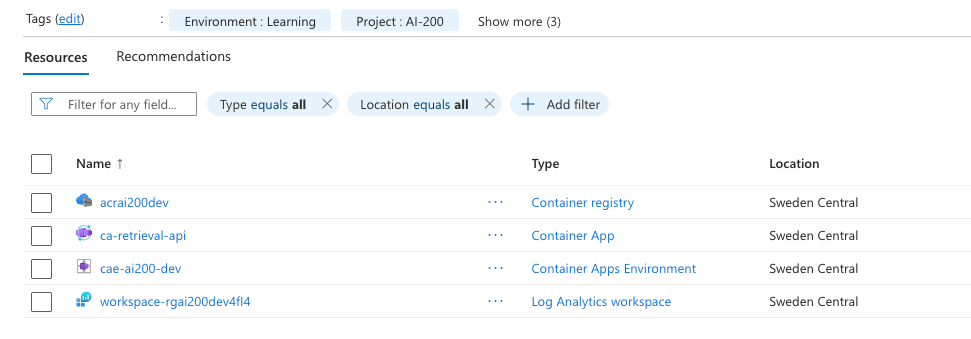

# Week 2: Deploy and manage apps on Azure Container Apps

Learning path: Deploy and manage apps on Azure Container Apps (3 modules)
Exam domain: Develop containerized solutions on Azure (20-25%)

Linked lab: [`../labs/02-container-apps/commands.sh`](../labs/02-container-apps/commands.sh)

## Module 1: Deploy containers to Azure Container Apps

### Why Container Apps exists

Last week App Service ran the `retrieval-api` container fine. What it could not do
was scale to zero (it billed while idle), run many replicas under load, or update
without an in-place restart gap. For a single web app none of that matters. It
starts to matter for event-driven, scaling, and zero-downtime workloads, which is
exactly what AI-200 is about.

Kubernetes does all of that, but it makes you run and manage a cluster. That is
week 3 (AKS). Container Apps is the middle option: it gives you Kubernetes' scaling
and rollout behaviour without running a cluster. Underneath, it literally is a
managed Kubernetes cluster with KEDA and Dapr installed, deliberately hidden from
you. That is not trivia. Knowing what is under the hood is how you predict its
behaviour (why exec works, why scale-to-zero has cold starts, why revisions look
the way they do).

The spectrum is worth committing to memory, because "which of these three" is a
recurring exam decision:

App Service (simplest, no orchestration) → Container Apps (orchestration, no
cluster) → AKS (full control, full complexity).

### The three core concepts

#### Environment: the boundary related apps share

An environment is the shared boundary for a set of related apps. Two things get
shared, and the payoff of each is worth being precise about.

It shares a virtual network. Apps in the same environment find and call each other
by internal DNS name, privately, with no public ingress. The payoff is
*addressability*, not shared storage. I initially guessed the point was shared
storage; the correction is that the model is "share a network so services can be
separate and still call each other." That is the microservices idea: independent
services, private addressing between them.

It shares a Log Analytics workspace. Every app in the environment logs to one
place, which is what makes end-to-end tracing across hops possible later (that pays
off in week 12).

Creating the environment auto-provisions a Log Analytics workspace as its own
resource. It shows up in the resource list with an Azure-generated name suffix. The
shared VNet, by contrast, is internal plumbing, not a separate line item you see in
the resource group.

#### Revisions: immutable snapshots

A revision is an immutable snapshot of the app, one per template version. The
motivation is the failure mode of App Service's in-place restart, which has two
distinct sub-problems:

1. A gap. During the restart the old version is down and the new one is not up yet.
2. No way back. Once the swap happens the old version is gone, so a broken deploy
   has no fast recovery.

Revisions fix both. A new revision comes up healthy before it takes any traffic, so
there is no gap. The old revision still exists after the switch, so rollback is a
pointer change measured in seconds, not a rebuild.

Because two healthy revisions can coexist, traffic splitting, canary, and
blue-green fall out for free. App Service cannot do this at all: only one version
ever runs.

What actually creates a new revision is the key detail. Template changes only:
image, environment variables, scale rules, CPU or memory. App-level changes do not:
managed identity, registry authentication, ingress. This line defines what a
"deploy" even is on this platform.

The default is single revision mode. Activating a new revision deactivates the old
one and scales it to zero. Inactive revisions do not appear in the default
`revision list`; you need `--all` to see them. They still exist as a rollback
target and cost nothing while scaled to zero.

Worked example from the lab. Five commands were run against the app: create,
identity assign, registry set, update (image + env), ingress update. That produced
only two revisions, one active. The create made the first revision; the image/env
update made the second. Identity, registry auth, and ingress are all app-level, so
none of them made a revision.

This connects back to week 1. An image is immutable, addressed by digest. A
revision is immutable too. Immutability buys reproducibility at the image layer and
safety at the deploy layer: the same idea applied one level up.

#### Scale-to-zero: `--min-replicas 0`

KEDA can drive the replica count to zero. No pods run when the app is idle, so idle
cost is zero. The cold start is the price of that: the first request after an idle
period hangs while a pod spins up, pulls the image, and boots. The free idle and
the cold start are the same coin. App Service B1 bills continuously *specifically
to* keep a warm instance and avoid exactly this.

The decision rule is real architecture, not exam trivia. Scale-to-zero is right
when an occasional slow first request is acceptable: internal tools, event workers,
dev environments, bursty traffic. It is wrong when every request must be fast, such
as a user-facing API with a latency SLA. For those, set `--min-replicas 1` (or
higher) to keep a warm pod, trading budget for latency.

Applied to ConspiraGraph: the retrieval API would likely run `min-replicas 1`
(users are querying, latency matters), while the ingestion worker runs
`min-replicas 0` (nobody is watching it, a cold start is fine).

### The managed-identity registry pull (third time, and the pattern transfers)

This is the third time this exact pattern has come up (App Service in week 1, now
Container Apps, AKS in week 3). Same four pieces, different command names:

1. The app has a system-assigned managed identity: an Entra service principal with
   no password, whose lifecycle is tied to the app.
2. That identity has `AcrPull` on the ACR. The role assignment is who = the
   principal, what = `AcrPull`, where = this registry only. Least privilege.
3. The app is configured to authenticate to the registry as that identity
   (`registry set --identity system`). This is Container Apps' equivalent of App
   Service's `acrUseManagedIdentityCreds`. Having a capability is not the same as
   being configured to use it: the identity *can* pull after step 2, but step 3 is
   what makes the app actually *choose* to authenticate as it. This is the piece
   people forget.
4. The app points at the private image.

The takeaway is that this is not "Container Apps auth." It is Azure's
managed-identity-to-resource pattern, and it works the same way for Key Vault,
Cosmos DB, and the rest. The surface (command names, portal blades) changes; the
pattern does not.

Reading a role assignment as JSON, which the exam sometimes shows and asks what it
grants: `principalType=ServicePrincipal` is the who, the `roleDefinitionId` GUID
resolves to `AcrPull` (the what), and `scope` is the registry (the where).

### Secrets and the `secretref:` pattern

The problem: a literal value in an environment variable sits in the container
template. It is visible in `az containerapp show`, in the config surface, and in
logs. That is fine for `APP_VERSION` and bad for a key or password.

The fix: store the value in the app's secret store and reference it from an
environment variable, `EXAMPLE_KEY=secretref:my-api-key`. The env var holds a
pointer; the value lives in the secret store. The template shows only the
reference.

What `secretref:` protects: the literal is kept out of the template, the config
surface, and CLI output.

What it does not protect: the value still lives in this app's own secret store,
readable by anyone with management rights on the app. And inside the running
container, `env` shows the resolved literal, because the code needs the real value
to authenticate. Plaintext in-process is a requirement, not a leak.

The ladder, where each rung fixes the previous rung's limit:

literal env var → app-level secret (`secretref:`) → Key Vault reference.

App-level secrets do not solve a secret shared across many apps: that is N copies
to rotate, N blast radii, and no central audit. Key Vault fixes that (week 12): one
governed, audited, rotatable vault, referenced by identity. And a Container Apps
secret can itself *be* a Key Vault reference, so `secretref:` is the plumbing that
connects the two. The mechanism extends; it is not replaced.

### Diagnostics: exec and logs

Logs are what the container said on stdout and stderr. Exec is a shell inside the
container to look around directly. Black-box recorder versus cockpit.

Exec was impossible on App Service F1 last week ("SSH not supported"). Container
Apps gives it because underneath it is Kubernetes and pod-exec is native.

The operational gotcha: you cannot exec into a scaled-to-zero app, because there is
nothing running to connect to. Curl it awake first, or temporarily set
`min-replicas 1` while debugging. I hit this live in the lab: exec failed at zero,
a curl woke a replica, then exec worked.

Logs stream to the environment's shared Log Analytics workspace. This single-app
view is what becomes cross-service KQL tracing in week 12, once several apps in the
same environment are all writing to the same workspace.

### Environment

The screenshot below shows the resource group after the environment was created:
the ACR from week 1, the Container Apps environment, and the auto-created Log
Analytics workspace with its Azure-generated name suffix.

### Commands

The full command sequence for this module, each line with an inline comment, is in
[`../labs/02-container-apps/commands.sh`](../labs/02-container-apps/commands.sh).
All IDs (subscription, tenant, principal) are captured into shell variables there
rather than hard-coded, so no real GUIDs land in the repo.

## Module 2: Manage containers in Azure Container Apps

Full notes: [`02b-container-apps-manage.md`](02b-container-apps-manage.md)
Linked lab: [`../labs/02-container-apps/commands-manage.sh`](../labs/02-container-apps/commands-manage.sh)

Module 1 was deploy. Module 2 is day two: revision mode versus traffic weights, the
pinning rule that arms canary behaviour, canary/rollback/blue-green as one mechanism,
health probes (readiness is traffic, liveness is life), HTTP versus TCP probes and
Azure's weak TCP defaults, and replica sizing under the fixed 1 vCPU : 2 GiB ratio.

The through-line: traffic is a dial, not a switch.

## Module 3: _TBD_

_Pending._
